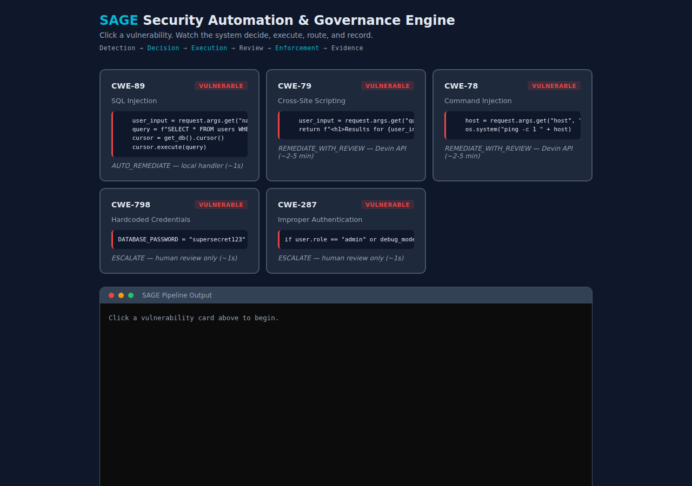

# Security Automation & Governance Engine (SAGE)

CodeQL flags dozens of new issues every week and they just pile up. Security files them, engineering ignores them, auditors flag the backlog. SAGE makes that operationally impossible.

```bash
python -m sage interactive    # open http://localhost:8000
```

Five vulnerable code blocks. Click one. Watch the policy engine decide, the execution layer fix it, and the routing panel show exactly which team, channel, and reviewer gets notified.

**[Live demo](https://demo-codeql-repo.onrender.com/)** — no setup required.



Built for MedSecure's security remediation challenge — where the last audit flagged a growing backlog of unresolved findings, no consistent SLA enforcement, and no evidence trail connecting detection to resolution.

---

## Setup

Python 3.12+ required. No external dependencies — stdlib only.

```bash
git clone <repo> && cd sage
python -m sage check          # validate configuration
python -m sage interactive    # open http://localhost:8000
```

---

## How it works

SAGE is a control plane between CodeQL and your engineering team. Findings go in. Fixed, reviewed, auditable outcomes come out.

```
Detection → Decision → Execution → Review → Enforcement → Evidence
  CodeQL     Policy     Devin      GitHub    SLA tracking   Audit log
             Engine     + local    + owners  + escalation
```

**Two execution paths, split by policy:**

| Policy | Execution | Example |
|---|---|---|
| `AUTO_REMEDIATE` | Local handler — instant fix, standard review | SQL injection (HIGH confidence) |
| `REMEDIATE_WITH_REVIEW` | Devin API — analyzes code, plans fix, opens PR, security reviewer required | XSS, command injection (MEDIUM confidence) |
| `ESCALATE` | No auto-fix — routed to owning team + security | Hardcoded credentials, auth flaws |
| `DEFER` | Logged, revisited later | Low-risk findings |

The local handler is the fast path for well-understood patterns — SQL injection with a known parameterization fix doesn't need an AI to reason about it. Devin handles the cases that do: cross-site scripting where the fix depends on rendering context, command injection where the safe alternative depends on what the subprocess actually does. CodeQL can detect these, but it can't fix them — its autofix covers a narrow set of pattern rewrites. A general-purpose copilot can suggest a patch, but it doesn't own the workflow. Devin creates a session, analyzes the surrounding code, plans a fix, opens a PR, and assigns the right reviewers. Policy decides which path — not the developer, not the tool.

**Proof of live integration:** Devin has created real branches in this repo via API — see [`devin/*` branches](../../branches/all?query=devin) for session artifacts, plans, and PRs.

---

## Demo

**Interactive** (recommended):
```bash
python -m sage interactive
```

**Full lifecycle** (5 phases — ingest, enforce, override, metrics, dashboard):
```bash
python -m sage full-demo
```

<details>
<summary><strong>All commands</strong></summary>

```bash
python -m sage demo                              # single alert
python -m sage batch demo/fixtures/              # batch processing
python -m sage sarif demo/fixtures/sample_scan.sarif  # SARIF input
python -m sage metrics                           # all 9 KPIs
python -m sage enforce                           # SLA + KPI enforcement
python -m sage override demo-001 merge           # human override
python -m sage override demo-001 status          # audit trail
python -m sage check                             # validate deployment
```

</details>

---

## Enforcement

Two layers, both with teeth.

**Per-finding SLA** — `python -m sage enforce` on hourly cron:

| Condition | Action |
|---|---|
| No review after 24h | Remind owner via team channel |
| No action after 48h | Escalate to `#engineering-leads` |
| SLA breach | Notify `#security-escalations`, auto-escalate |

**Aggregate KPI** — when metrics degrade, the system acts:

| KPI crosses threshold | System action |
|---|---|
| SLA compliance < 80% | Escalate all at-risk findings |
| Lifecycle completion < 80% | Notify security lead |
| PR merge rate < 60% | Flag trust issue |
| Unowned findings > 0 | Auto-assign to default team |

KPIs aren't a dashboard. They drive system behavior. Thresholds configured in `sage.config.json`.

---

## Developer experience

Engineers don't interact with SAGE directly — they interact with pull requests. A SAGE-generated PR arrives with the vulnerability context, the fix, the CWE reference, and the right reviewers already assigned. The engineer reviews code, not a security ticket.

If the fix is wrong, the engineer rejects it: `python -m sage override <id> reject`. If it needs more context, they escalate it: `python -m sage override <id> escalate`. Every override is logged with the actor, timestamp, and reason — creating the audit trail that satisfies compliance without adding process overhead.

The goal is to make the secure path the path of least resistance. Findings don't pile up in a backlog because SAGE converts them into reviewable PRs before the next standup.

---

## KPIs

```
$ python -m sage metrics

  OUTCOME METRICS
  SLA Compliance Rate:       33% (1/3 high-risk resolved within SLA)
  Mean Time to Remediation:  0m
  Aging High-Risk Backlog:   2 open (2 within SLA, 0 breached)

  SYSTEM EFFECTIVENESS
  Auto-Remediation Rate:     100% (3/3 resolved via automation)
  PR Merge Rate:             33% (1/3 PRs merged)

  GOVERNANCE
  Unowned Findings:          PASS
  SLA Breaches:              PASS
  Lifecycle Completion:      33% (1/3 reached terminal state)
```

9 metrics across three categories: outcome, system effectiveness, governance. All computed from `pipeline.db`.

---

## Integration

| System | How to enable | What happens |
|---|---|---|
| Devin | `DEVIN_MODE=real` + `DEVIN_API_KEY` | Creates sessions, polls completion, extracts plan + PR + insights |
| GitHub | `PR_MODE=github` | Branch → commit → push → PR with reviewers + labels via `gh` |
| Slack | `NOTIFY_MODE=slack` + `SLACK_WEBHOOK_URL` | Block Kit messages to team channels + escalation channels |

All fall back to stub mode when env vars aren't set. `python -m sage check` validates connectivity.

**Environment variables:**

| Variable | Required for | Default |
|---|---|---|
| `DEVIN_MODE` | Devin integration | `stub` |
| `DEVIN_API_KEY` | Devin API calls | — |
| `PR_MODE` | GitHub PR creation | `stub` |
| `NOTIFY_MODE` | Slack notifications | `stub` |
| `SLACK_WEBHOOK_URL` | Slack delivery | — |

All integrations have been tested live — see [`devin/*` branches](../../branches/all?query=devin) for real API session artifacts.

<details>
<summary><strong>Architecture details</strong></summary>

```
   ┌──────────┐      ┌──────────────┐      ┌──────────┐      ┌─────────────┐
   │  CodeQL  │ ───▶ │ Policy Engine│ ───▶ │  Devin   │ ───▶ │   GitHub PR │
   │ Findings │      │ Risk + Fix   │      │ Remediate│      │ + Reviewers │
   └──────────┘      │ Confidence   │      └──────────┘      └─────────────┘
                     └──────┬───────┘                               │
                            │                                       ▼
                            │                              ┌─────────────────┐
                            ├─────────────────────────────▶│ Enforcement Loop│
                            │                              │ Remind /Escalate│
                            ▼                              └────────┬────────┘
                    ┌──────────────┐                                │
                    │ Escalation   │ ◀──────────────────────────────┘
                    │ Security / EM│
                    └──────┬───────┘
                           ▼
                    ┌──────────────┐
                    │  Audit Trail │
                    │ Evidence Log │
                    └──────────────┘
```

| Layer | Module |
|---|---|
| Detection | `sage/pipeline/ingest.py`, `sage/pipeline/sarif.py` |
| Decision | `sage/pipeline/policy.py`, `sage/pipeline/triage.py` |
| Execution | `sage/integrations/devin_client.py`, `sage/pipeline/execute.py` |
| Review | `sage/integrations/pr_client.py`, `sage/integrations/notify.py` |
| Enforcement | `sage/pipeline/enforcement.py`, `sage/cli/enforce.py` |
| Evidence | `sage/pipeline/store.py`, `sage/pipeline/output.py` |
| Override | `sage/cli/override.py` |

**Policy table:**

| CWE | Name | Action | Confidence | SLA |
|---|---|---|---|---|
| CWE-89 | SQL Injection | `AUTO_REMEDIATE` | HIGH | 24h |
| CWE-79 | Cross-Site Scripting | `REMEDIATE_WITH_REVIEW` | MEDIUM | 24h |
| CWE-78 | Command Injection | `REMEDIATE_WITH_REVIEW` | MEDIUM | 24h |
| CWE-798 | Hardcoded Credentials | `ESCALATE` | LOW | 12h |
| CWE-287 | Improper Authentication | `ESCALATE` | LOW | 12h |

**Lifecycle:**

```
DETECTED → TRIAGED → REMEDIATED → UNDER_REVIEW → MERGED → CLOSED
                   ↘ ESCALATED (policy, SLA breach, or KPI trigger)
                   ↘ DEFERRED (low-risk)
```

Every transition is timestamped. Invalid transitions are rejected. `python -m sage override` provides human merge/reject/defer/escalate/reopen.

**CI/CD** — `.github/workflows/sage.yml`:
- Triggers on CodeQL completion, hourly cron, or manual dispatch
- Fetches alerts via `gh api`, runs pipeline, enforces KPIs, uploads artifacts

</details>

---

## Tests

```bash
python -m pytest tests/ -v    # 86 tests
```

Covers: ingest, triage, policy, execute (5 CWEs × 4 SQL patterns), validate, store, enforcement (SLA + KPI-driven), notifications, escalation routing, dashboard, and human overrides.

---

## Docs

| Document | Description |
|---|---|
| [docs/requirements.md](docs/requirements.md) | 12 functional, 7 non-functional, 5 governance requirements |
| [docs/kpis.md](docs/kpis.md) | 9 KPIs mapped to the system components that drive them |
| [CONTRIBUTING.md](CONTRIBUTING.md) | Adding CWEs, integrations, and running tests |

---

## License

[MIT](LICENSE)
